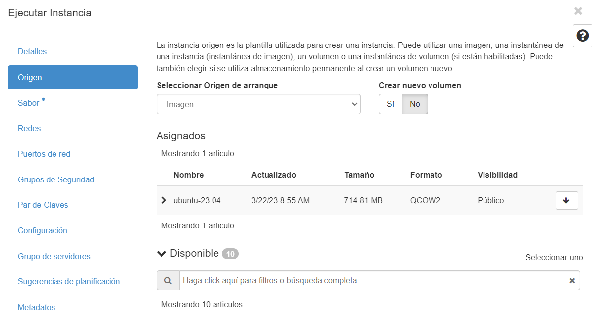

# Práctica01-daw

Primeramente creamos una instancia con su nombre:

En origen seleccionamos imagen y le damos a NO crear nuevo volumen:

En sabor elegimos en que queramos:

Le asignamos un par de claves, en mi caso escogí una que ya tenía creada:

Ya tenemos creada la instancia y está corriendo:

Le asignamos su IP flotante:

Y así quedaría:

Ahora en Visual Studio vamos a conectarnos a un Host:

Le pinchamos a Add New SSH Host...

Tenemos que escribir lo siguiente con la IP flotante respectiva a nuestra instancia:

Una vez esté listo esto, nos metemos al archivo de config, donde en el Host añadiremos esa última línea de IdentifyFile:

Seleccionamos Linux:

Le damos a Clone Repository:

Y pegamos el repositorio de nuestro GitHub creado anteriormente:

Ahora lo tenemos vinculado y nos saldrán los archivos cada vez q nos metamos a practica01-daw:

Estos son los archivos necesarios para esta práctica:

## Install_lamp

Instalamos Apache:

**apt install apache2 -y**

Instalamos PHP:

**apt install php libapache2-mod-php php-mysql -y**

**apt install mysql-server**

Copiamos el archivo de configuración de Apache:

**cp ../conf/000-default.conf /etc/apache2/sites-available**

Reiniciamos el servicio de Apache:

**systemctl restart apache2**

Copiamos el archivo de prueba de PHP:

**cp ../php/index.php /var/www/html**

Cambiamos el usaurio y el propietario del directorio de /var/www/html:

**chown -R www-data:www-data /var/www/html**

## Install_tools

`echo "phpmyadmin phpmyadmin/reconfigure-webserver multiselect apache2" | debconf-set-selections`: Este comando utiliza la utilidad **echo** para proporcionar una respuesta preconfigurada a la herramienta de configuración **debconf** durante la instalación de phpMyAdmin.

`echo "phpmyadmin phpmyadmin/dbconfig-install boolean true" | debconf-set-selections`: Este comando establece que se debe instalar la configuración de la base de datos para phpMyAdmin (dbconfig-install) y configura esta opción como "true".

`echo "phpmyadmin phpmyadmin/mysql/app-pass password $PHPMYADMIN_APP_PASSWORD" | debconf-set-selections`: Configura la contraseña de la aplicación para phpMyAdmin. **$PHPMYADMIN_APP_PASSWORD** debe ser una variable que contenga la contraseña deseada. Esto se utiliza para autenticarse en phpMyAdmin.

`echo "phpmyadmin phpmyadmin/app-password-confirm password $PHPMYADMIN_APP_PASSWORD" | debconf-set-selections`: Confirma la contraseña de la aplicación para phpMyAdmin.

`sudo apt install phpmyadmin php-mbstring php-zip php-gd php-json php-curl`: Este comando utiliza **apt** para instalar phpMyAdmin y una serie de extensiones de PHP necesarias para su funcionamiento.

`mkdir -p /var/www/html/adminer`: Crea un directorio llamado "adminer" en la ruta **/var/www/html**. La opción **-p** garantiza que se crearán los directorios padres si no existen.

`wget https://github.com/vrana/adminer/releases/download/v4.8.1/adminer-4.8.1-mysql.php -P /var/www/html/adminer`: Descarga el archivo "adminer-4.8.1-mysql.php" desde la URL proporcionada y lo guarda en el directorio "/var/www/html/adminer".

`mv /var/www/html/adminer/adminer-4.8.1-mysql.php /var/www/html/adminer/index.php`: Cambia el nombre del archivo descargado "adminer-4.8.1-mysql.php" a "index.php".

`chown -R www-data:www-data /var/www/html`: Cambia el propietario y el grupo del directorio "/var/www/html" y de todos sus contenidos al usuario y grupo "www-data".

`apt install goaccess -y`: Utiliza el sistema de administración de paquetes APT para instalar la herramienta GoAccess con la opción "-y", que confirma automáticamente cualquier pregunta durante la instalación.

`mkdir -p /var/www/html/stats`: Crea un directorio llamado "stats" en la ruta **/var/www/html**.

`goaccess /var/log/apache2/access.log -o /var/www/html/stats/index.html --log-format=COMBINED --real-time-html --daemonize`: Este comando ejecuta GoAccess en el archivo de registro de acceso del servidor web Apache ubicado en **/var/log/apache2/access.log**. Luego, genera un informe en tiempo real en formato HTML y lo guarda en **/var/www/html/stats/index.html**.

`htpasswd -bc /etc/apache2/.htpasswd $STATS_USERNAME $STATS_PASSWORD`: Este comando se utiliza para crear un archivo de contraseñas que se utiliza para autenticarse en el informe de estadísticas generado por GoAccess.

`cp ../conf/000-default-htaccess.conf /etc/apache2/sites-available/000-default.conf`: Este comando copia el archivo de configuración **000-default-htaccess.conf** desde el directorio **../conf** al directorio **/etc/apache2/sites-available** y lo renombra como **000-default.conf**.

`cp ../htaccess/.htaccess /var/www/html/stats`: Este comando copia el archivo **.htaccess** desde el directorio **../htaccess** al directorio **/var/www/html/stats**.

`systemctl restart apache2`: Este comando reinicia el servicio de Apache en el sistema.

## Resultado.

Ahora si entramos a Google y colocamos la IP flotante nos saldrá esto:

Si queremos ver Adminer saldría así:

Y si ponemos stats nos saldrá así:

